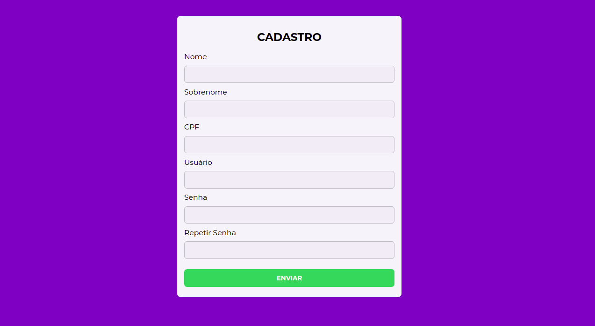

# [Validando formulário](https://heyloh.github.io/validando-form/index.html)
📝 Projeto simples de formulário de cadastro para praticar validação usando classes no JavaScript.

  

#### O que tive que fazer?
- Prática com classes
- Lidar com erros
- Validação de formulário
- Manipulação da DOM

Eu disse que era simples 🤷🏽